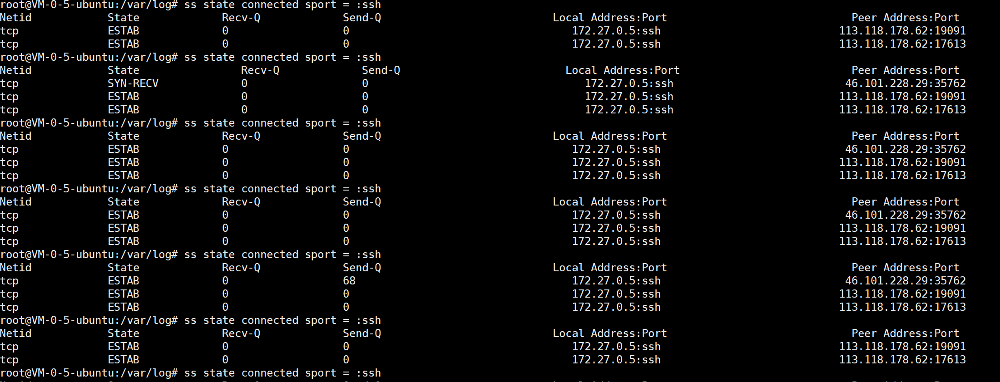

## 会话查看，当前存在连接

查看ssh连接状态：

ss state connected sport = :ssh

ss -4 -a

## 日志文件查看

Ubuntu18 

1、有关当前登录用户的信息记录在文件utmp中；==who命令（无）

2、登录进入和退出纪录在文件wtmp中；==w命令

3、最后一次登录文件可以用lastlog命令察看；

4、messages======从syslog中记录信息

注意：wtmp和utmp文件都是二进制文件，他们不能被诸如tail命令剪贴或合并（使用cat命令）。用户需要使用who、w、users、last和ac来使用这两个文件包含的信息。

例子：
　　last命令往回搜索wtmp来显示自从文件第一次创建以来登录过的用户

　　users用单独的一行打印出当前登录的用户，每个显示的用户名对应一个登录会话

　　w命令查询utmp文件并显示当前系统中每个用户和它所运行的进程信息

　　who命令查询utmp文件并报告当前登录的每个用户

　　ac命令根据当前的/var/log/wtmp文件中的登录进入和退出来报告用户连结的时间（小时）

　　